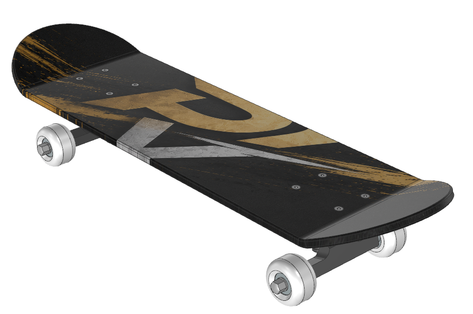
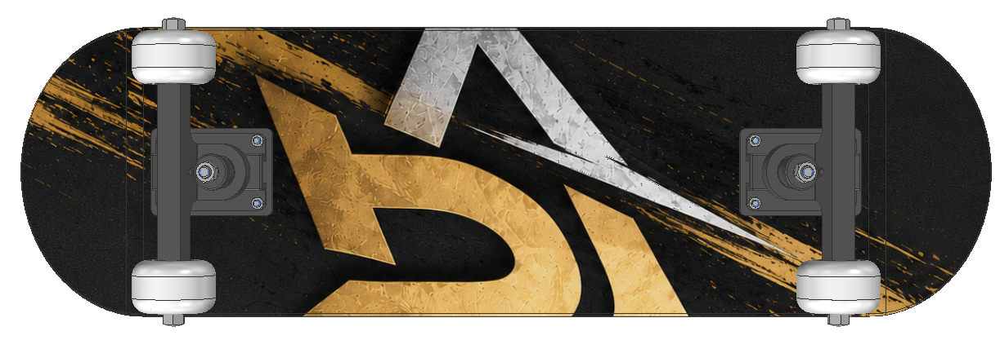

# Siemens NX CAD – Skateboard Assembly

**Praveen Venkatesh Sethumadhavan Vasan**  
CAD project work completed with **Siemens NX 2412** at alfatraining Bildungszentrum GmbH  
**Project period:** 11.05.2026 – 03.07.2026

## Project overview

A complete CAD construction and assembly project developed in Siemens NX 2412.

The project covers the workflow from individual part modelling to subassemblies, complete assembly, assembly sequencing, engineering drawings, BOM and geometric quality checks.

## Visual overview

### Complete assembly

### Assembly detail

### Exploded assembly

## What this project demonstrates

- Part Design and feature-based modelling
- Assembly Design using a bottom-up approach
- Subassemblies for axle and wheel systems
- Assembly constraints (Flush, Touch, Align)
- Standard parts from the NX library
- Bill of Materials with 16 positions
- Assembly and disassembly sequencing
- Exploded-view documentation
- Engineering drawings for parts and assemblies
- Collision / interference checking
- Portable clone assembly and reference management
- Material and mass-property definition

## CAD structure

**Individual parts → subassemblies → complete skateboard assembly**

The project includes six detailed part drawings and assembly drawings for the axle, wheel and main assembly.

## Quality checks

A full assembly collision check was performed. No unwanted penetrations were found; contacts were limited to defined contact areas and threaded connections.

The assembly was also cloned to create portable project references without broken links.

## Engineering drawings & BOM

The repository includes a compiled PDF with the project's Siemens NX engineering drawings and assembly documentation, grouped into **Einzelteil**, **Baugruppe** and **Explodedview** sections.

📄 [View Siemens NX CAD Documentation – Einzelteil, Baugruppe & Explodedview](Alfa_Siemens_NX_CAD_Dokumentation_Gruppiert.pdf)

## FEM / CAE outlook

The CAD model was prepared as a basis for possible downstream CAE work. Potential studies include bending stiffness, stresses in the axle/fixture and deformation of the rubber bushing.

**Important:** the FEM and Digital Twin topics are an outlook for further work; they are not claimed as results of this CAD project.

## Project documentation

The project presentation is also included in this repository and documents the complete Siemens NX workflow.

📊 [View Project Presentation](Skateboard_Projektarbeit_Praveen.pptx)

## Relevance to CAE engineering

The project complements my professional FEM background by demonstrating hands-on CAD exposure, assembly modelling and engineering documentation in Siemens NX.

My professional CAD experience also includes CATIA V5, used for simulation and test-related model preparation.

**Project type:** Training / project work – not industrial production development.
